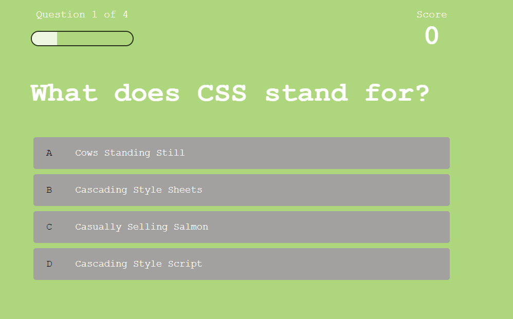
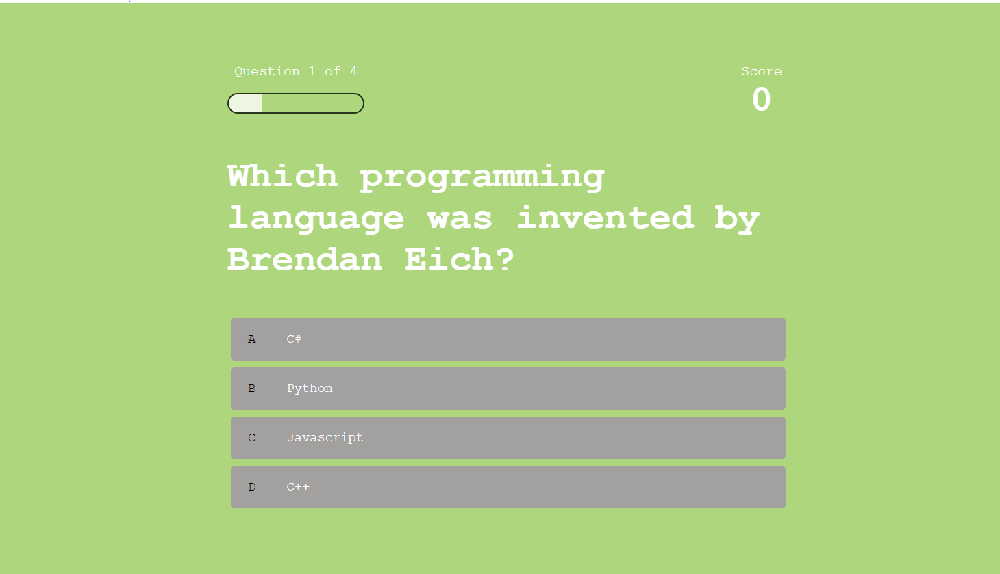
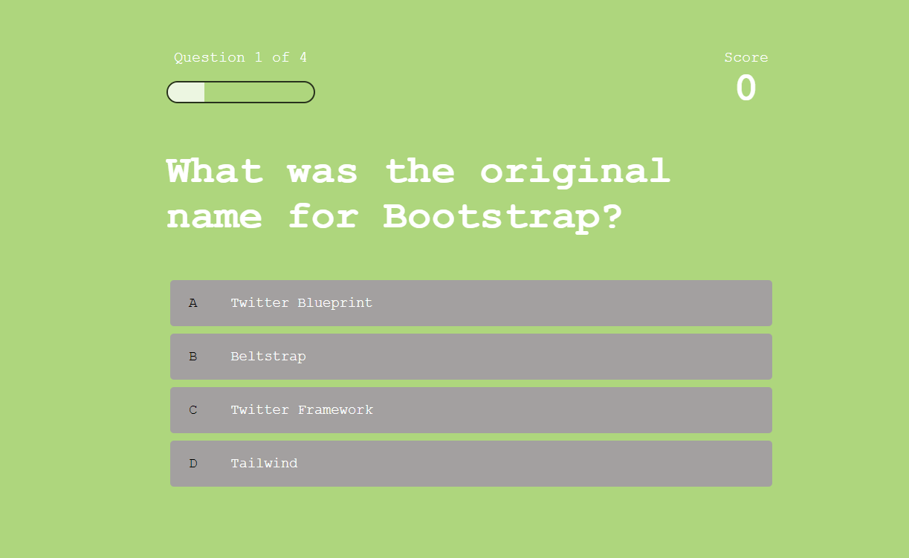
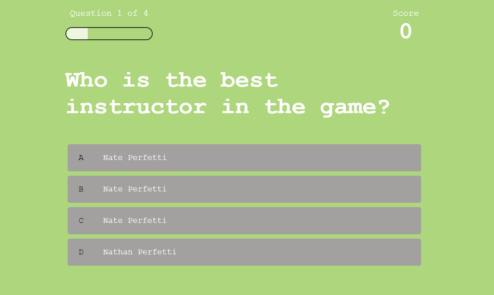

# Challenge-Week-4 // Multiple Choice Quiz

## Description
This webpage is designed to be an easy, multiple choice quiz game with four questions. The game is designed to have an active timer and also have time decrement when the player incorrectly answers a question. Currently, this project is still in-development and doesn't satisfy all acceptance criteria. 

## What is Complete / Incomplete?
The application currently has html created for a beginning page and also for the quiz itself. The questions have been described, and the quiz partially functions. Still, I was unable to get the time-counter feature added, and I still have to develop the High Scores page and some of the question functionality. 

## What Adversity did I face during this Web App Design?
The past two weeks have been a struggle for me to set aside the necessary time for bootcamp. Prior to signing up for the course I had some obligations for work spanning the middle weeks of September. Due to a work conference in Ohio I unfortunately missed two classes last week, but was able to watch the recordings once I returned home to Florida. Additionally, since returning I have spent the last few days preparing for the incoming Hurricane Ian. I will turn in Challenge 4 in it's current version, but I do intend to update the repo later. 

## View My Work Here ↓

## Webpage Screenshots ↓

